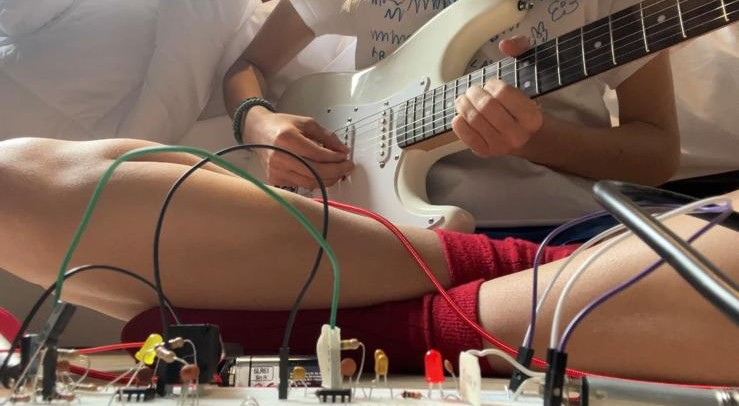
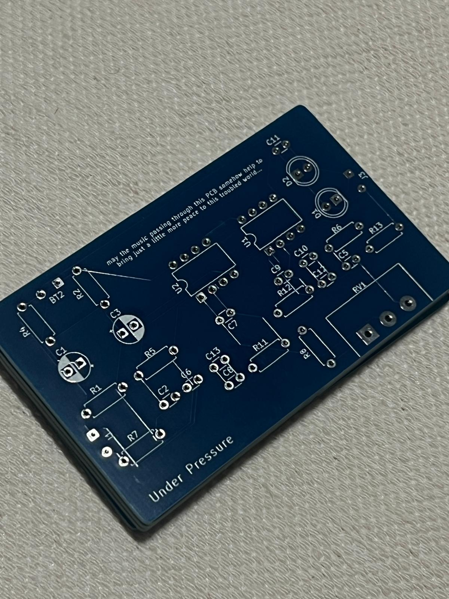
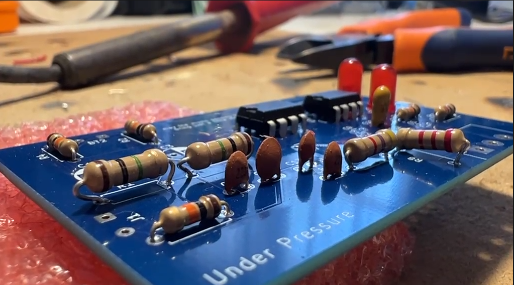

# Under Pressure - Analog Distortion Pedal

A complete documentation of designing and building an analog distortion pedal for electric guitars, based on Brian Wampler's minimal parts-count circuit design.


### 🎵 About the Name

**Under Pressure** is named after the iconic 1981 song by David Bowie & Queen. The name captures the essence of what a distortion pedal does: it takes the natural dynamics of a guitar signal and compresses it under intense pressure, forcing it through clipping stages that create the characteristic aggressive and driven tone.

## 🎯 Project Overview

This project is divided into **three distinct phases**, each with its own workflow and deliverables:

1. **Phase 01: Breadboard Prototype** - Testing and validation on solderless breadboard
2. **Phase 02: PCB Design** - Professional PCB layout and manufacturing
3. **Phase 03: PCB Soldering** - Attaching the components to the designed PCB

## ✅ Current Build Status

- **Breadboard Prototype**: Complete and working with guitar + amp validation.
- **PCB Design**: Complete (layout, DRC, Gerbers, and drill files generated).
- **PCB Soldering**: Complete and fully assembled; the pedal was soldered, inspected, and tested.

##  Build Progress Photos

### Breadboard Prototype


### Guitar Validation


### PCB Before Soldering


### PCB After Soldering


## �📐 Circuit Architecture

- ⚡ **Stage 1**: 9V battery with virtual ground (Vref) biasing
- 📈 **Stage 2**: implements two gain stages with clipping diodes to shape the distortion character
- 🎚️ **Stage 3**: provides final amplification with impedance buffering for clean output

## 📂 Project Structure

```
├── docs/              # Design documentation & notes
├── hardware/          # Circuit & PCB files
│   ├── breadboard/    # Phase 01: Prototype testing
│   ├── components/    # Datasheets & BOM
│   ├── pcb/           # Phase 02: PCB design & Gerber files
│   └── schematics/    # KiCad schematics
├── simulations/       # SPICE circuit analysis
├── audio/             # Test recordings
└── images/            # Build photos & diagrams
```

## 🚀 Quick Start

### For Breadboard (Phase 01)

1. Understand the schematics
2. Buy the needed components
3. Replicate the circuit on a breadboard
4. Plug your guitar, test audio and tone
5. Confirm ready for PCB

### For PCB Design (Phase 02)

1. Use KiCad (9.0) to create schematics
2. Design PCB layout
3. Generate Gerber files
4. Run final DRC/ERC checks
5. Place order with PCB manufacturer

**Design note**: when I printed the board, some resistor footprints looked a bit small, so the resistor bodies felt too large for the available space. Keep footprint size and component body clearance in mind before finalizing the layout.

### For PCB Soldering (Phase 03)

1. Prepare the workspace with the PCB, components, soldering iron, solder, and a magnifier or helping hands tool.
2. Start with the smaller and lower-profile components such as resistors, diodes, and ceramic capacitors.
3. Solder the larger parts next, including electrolytic capacitors, potentiometers, and the input/output jacks.
4. Check each joint carefully for good wetting and avoid cold joints or bridges between pads.
5. Connect the pedal to power and verify the circuit with a guitar and amplifier.
6. Confirm that the distortion works as expected, the output is stable, and the pedal is ready for enclosure or final finishing.

**Result**: the pedal is already soldered and finished, and the assembled board was validated with audio testing.

## 📚 Documentation Roadmap

```
PHASE 01: Breadboard                    PHASE 02: PCB Design                    PHASE 03: PCB Soldering
├── ✅ Understand circuit               ├── ✅ Verify breadboard values         ├── ✅ Prepare soldering tools
├── ✅ Source components                ├── ✅ Create schematic in KiCad        ├── ✅ Solder components
├── ✅ Build on breadboard              ├── ✅ Design PCB layout                ├── ✅ Inspect solder joints
├── ✅ Test audio and tone              ├── ✅ Run design rule check (DRC)      └── ✅ Test PCB functionality
├── ✅ Document final values            ├── ✅ Generate Gerber files
└── ✅ Confirm ready for PCB            └── ✅ Order PCB
```

## 🔗 References

- **Main Tutorial**: [How to Design a Basic Distortion Pedal Circuit](https://www.wamplerpedals.com/blog/lifestyle-hobby/2024/08/how-to-design-a-basic-distortion-pedal-circuit/) - Brian Wampler
- **Main Component Sourcing**: Electronica Embajadores - https://www.electronicaembajadores.com/es/

## 📊 Project Status

| Phase | Status | Progress |
|-------|--------|----------|
| Phase 01: Breadboard | ✅ Done | Fully working and validated |
| Phase 02: PCB Design | ✅ Done | Designed and ready for manufacturer order |
| Phase 03: PCB Soldering | ✅ Done | Welded and tested |

## 🛠️ Tools Needed

**Phase 01 (Breadboard)**:
- Solderless breadboard
- Multimeter (for voltage/continuity testing)
- Wires
- Guitar & amplifier (for audio testing)

**Phase 02 (PCB Design)**:
- KiCad
- Gerber viewer (integrated in KiCad)
- PCB manufacturer (JLCPCB, PCBWay, Elecrow, etc.)

**Phase 03 (PCB Soldering)**:
- Soldering iron
- Lead-free solder (0.8-1.0mm)
- Solder sucker or desoldering wick
- Brass cleaner or damp sponge
- Helping hands tool

---

**Last Updated**: August 3rd, 2026 | **Design Based On**: Wampler Basic Distortion Circuit (Aug 2024) | **Build Status**: Project complete, breadboard validated, PCB fabricated, and pedal assembled