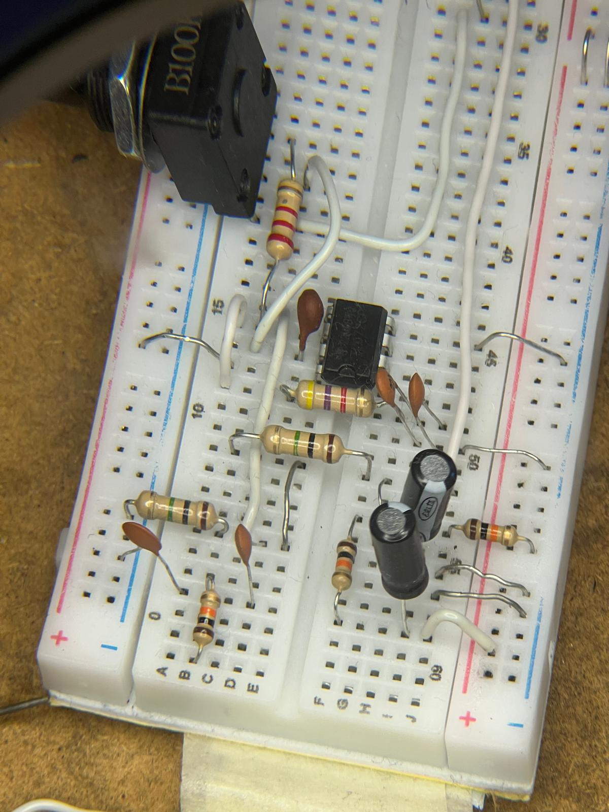
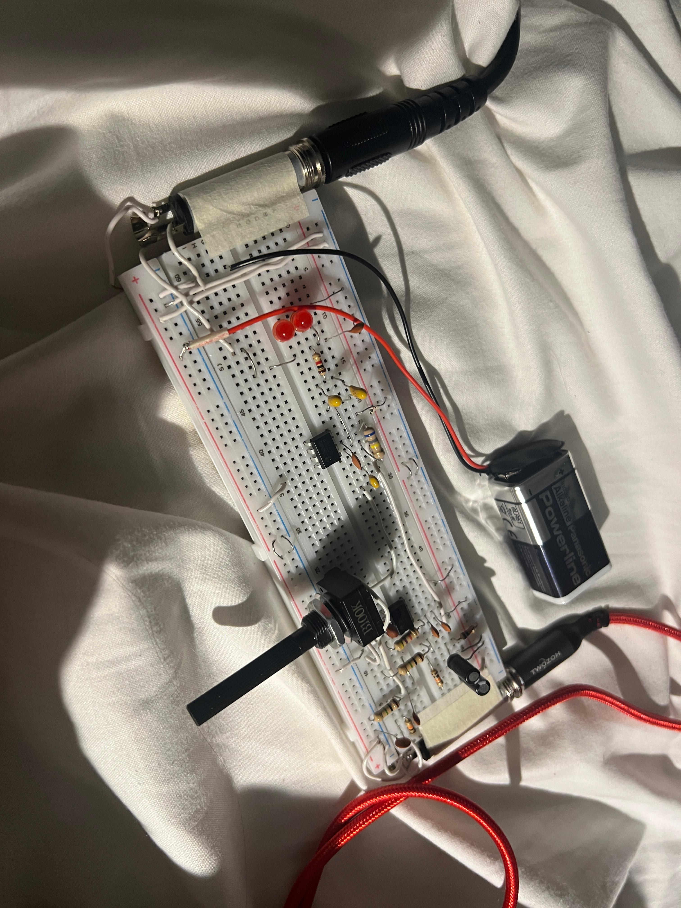

# Breadboard Prototype

Current status: Breadboard build is complete and working.

## Photos

## Validation Summary

- Power stage tested at 9V with stable virtual ground (Vref).
- Input and gain response verified.
- Clipping stage verified with smooth distortion behavior.
- Audio output tested with guitar and amplifier.

## Final Result

- Breadboard prototype validated successfully.
- The circuit was carried forward into the completed PCB build.